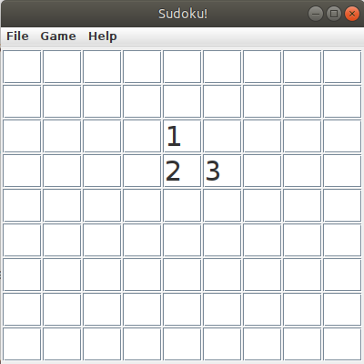

# Sudoku!

Hello. I'm the one who writes markown file to describe my dumby ideas.

This can help you solve sudoku, but is useless in terms of spaghetti cooking. Please ask Papyrus.

I guess I should describe it here, so here it is.

I wrote a full explaination of the working principles of this program [here](details/Explaination-full.md).

## Challenge

There is a way to break the program. At least, I tought to a scenario that I did not explicitly handled, so that I cannot tell you what will happen in that case.

The challenge is not to find it and have the time of your life without having that bug.

# Capture

# User manual
I don't advise you to read this, this is dumb enough so that I really hesitated to write this.

But it's quite fun to do (?) so here it is.

## File menu

> Open

This is used to open a text file describing a sudoku. Their (simple or dumb, idk) structure is described [here](SudokuFormatting.md).

> Save

Save a sudoku, correctly formatted, to a text file.

> Info

Shows a short info about this shit.

> Quit

Unlocks the ability of spaghetti cooking: this program is not able to, but you are irl.

## Game menu

> Reset

Resets the grid to all editable blanks. Shortcut: [`R`]

> Validate

Validates all the numbers present on the current grid. It is not possible to validate an inconsistent grid (that is, two or more cells clash). Shortcut: [`V`]

> Play one move

Plays one move, that may constitute an assumption. Any sure move will be played before taking assumptions. Shortcut: [`O`]

> Solve

Tries to solve the current grid. Shortcut: [`S`]

## Help menu

Writing help about help menu is really cool, isn't it ?

> Shortcuts

Does not show anything about shorcuts.

> About files...

Does not show anythong about the file structure.